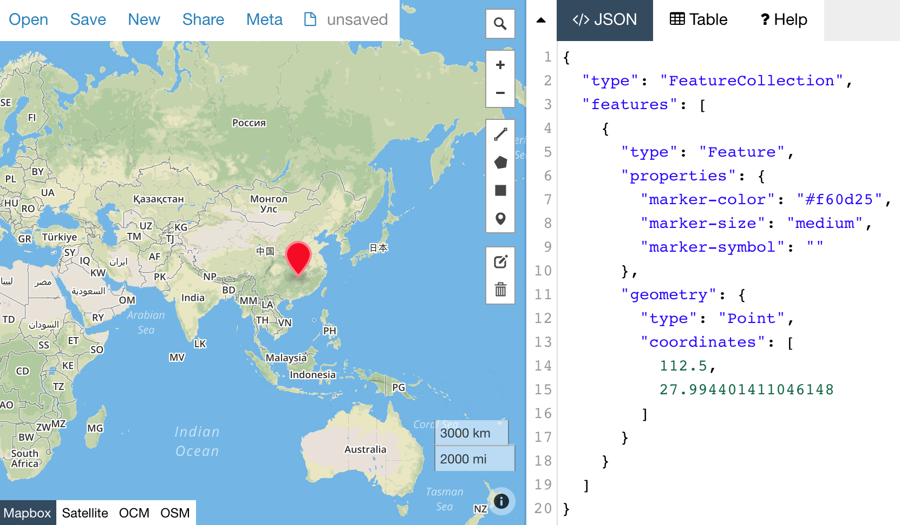

# geotoolkit
收集那些有用的、好用的与地理数据管理、地理空间分析、地图相关的工具和项目。


# geojson

- <http://geojson.io>：在浏览器地图中，编辑和预览geojson。可以很方便在地图上面添加点、路线、多边形等feature，并对feature设置属性，最终的geojson可导出，如图：

  

- [geojsonio-cli：](https://github.com/mapbox/geojsonio-cli) 命令行工具，通过参数指定geojson文件，调起geojson.io网页并加载geojson数据。对不大的geojson文件，可生成一个链接用于分享，别人点开这个链接将在浏览器里自动打开 <http://geojson.io> 预览这个数据

- [togeojson](https://github.com/mapbox/togeojson)：将kml转成geojson，跟geojson命令行工具合起来用，可实现在地图中预览kml的效果：```togeojson foo.kml | geojsonio```

- [geojson-vt](https://github.com/mapbox/geojson-vt)：将geojson转换成矢量瓦片，C++版本：[geojson-vt-cpp](https://github.com/mapbox/geojson-vt-cpp)

-  [geojson-area](https://github.com/mapbox/geojson-area)：计算geojson里polygon和multipolygon的面积，命令行工具：[geojson-area cli](https://github.com/scisco/area) 

- [tippecanoe](https://github.com/mapbox/tippecanoe)：mapbox出品，可基于大型的geojson数据集一次构建多个zoom（地图缩放等级）的矢量瓦片

- <https://mapshaper.org>：在浏览器里可视化编辑geojson等数据，与geojosn.io不同的是，它不显地图，但它包含了很棒的抽稀工具、命令行交互，最终效果可以导出geojson等格式。


# 算法

- [simplify-geojson](https://github.com/maxogden/simplify-geojson)：使用道格拉斯-普克算法，对geojson里的线、多边形轮廓进行抽稀，用较少的点来近似表示一条原本较平滑的路径，命令示例：```cat data.geojson | simplify-geojson -t 0.01```

  


# 综合

- <http://turfjs.org/>：Advanced geospatial analysis for browsers and Node.js